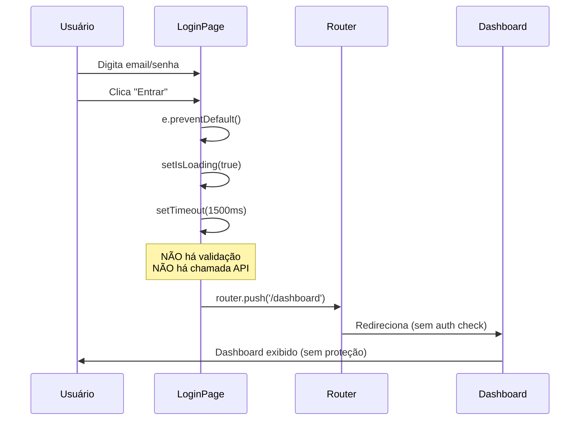

# 🔐 Módulo de Autenticação - PhysioNote.AI

**Última atualização:** 26 de outubro de 2025  
**Status:** ⚠️ **EM DESENVOLVIMENTO - SIMULADO**

---

## 📋 Visão Geral

O módulo de autenticação do PhysioNote.AI está **parcialmente implementado**. Atualmente, apenas a interface de usuário (UI) está completa e funcional. A lógica de backend, validação de credenciais e gerenciamento de sessão **NÃO estão implementados**.

### ⚠️ Estado Atual: Login Simulado

O sistema atual realiza um **login fake** que:
- ✅ Apresenta interface profissional e funcional
- ❌ **NÃO valida credenciais** (aceita qualquer email/senha)
- ❌ **NÃO cria sessão ou token**
- ❌ **NÃO protege rotas** (dashboard é público)
- ⏱️ Aguarda 1.5 segundos (simula chamada API) e redireciona para `/dashboard`

---

## 🏗️ Arquitetura Atual

### Estrutura de Arquivos

```
src/
├── app/
│   └── login/
│       └── page.tsx              # Rota Next.js (/login)
└── components/
    └── auth/
        ├── LoginPage.tsx         # Componente principal de login
        └── index.ts              # Export barrel
```

### Fluxo de Autenticação (Simulado)



---

## 💻 Componentes Implementados

### 1. LoginPage.tsx

**Localização:** `src/components/auth/LoginPage.tsx`  
**Linhas:** 241  
**Status:** ✅ Completo (UI only)

#### Funcionalidades da UI

```typescript
// Estados gerenciados
const [email, setEmail] = useState('');           // Email do usuário
const [password, setPassword] = useState('');     // Senha do usuário
const [showPassword, setShowPassword] = useState(false); // Toggle de visibilidade
const [isLoading, setIsLoading] = useState(false); // Estado de loading
```

#### Campos do Formulário

| Campo | Tipo | Validação | Ícone | Funcionalidade Extra |
|-------|------|-----------|-------|----------------------|
| **Email** | `email` | HTML5 required | `Mail` | Autocomplete habilitado |
| **Senha** | `password` | HTML5 required | `Lock` | Toggle show/hide password |

#### Elementos da Interface

- ✅ Logo e título PhysioNote.AI
- ✅ Mensagem de boas-vindas
- ✅ Campos de formulário com ícones
- ✅ Toggle de visibilidade de senha (`Eye`/`EyeOff`)
- ✅ Link "Esqueceu a senha?" → `/forgot-password`
- ✅ Botão de submit com loading spinner
- ✅ Link "Criar Conta" → `/signup`
- ✅ Links de rodapé: Privacy, Terms, LGPD
- ✅ Link "Voltar para página inicial" → `/`

#### Animações Implementadas

```css
/* Classes de animação Tailwind */
.animate-fade-in-up         /* Container principal */
.animate-hero-title         /* Logo e título */
.animate-hero-subtitle      /* Mensagem de boas-vindas */
.animate-hero-button-primary   /* Campo de email */
.animate-hero-button-secondary /* Campo de senha */
.animate-nav-item-1         /* Link "Esqueceu senha" */
.animate-nav-item-2         /* Botão "Entrar" */
.animate-nav-item-3         /* Divider "ou" */
.animate-header-login       /* Rodapé e links */
```

#### Design System

**Cores utilizadas:**
- `bg-neutral-light` - Fundo da página
- `bg-white` - Card de login
- `bg-[#4F46E5]` - Logo (primary-blue)
- `text-[#111827]` - Título (neutral-dark)
- `text-neutral-medium` - Labels e textos secundários
- `border-gray-200` - Bordas dos inputs
- `focus:ring-primary-blue` - Focus state

**Responsividade:**
- Mobile-first design
- Breakpoints: `sm:`, `lg:`
- Padding adaptativo: `px-4 sm:px-6 lg:px-8`
- Card responsivo: `p-8 sm:p-10`

---

## 🔴 Funcionalidades NÃO Implementadas

### Backend de Autenticação

❌ **Não existe nenhum endpoint de API:**

```bash
# Endpoints esperados (NÃO implementados):
/api/auth/login      # POST - Validar credenciais
/api/auth/logout     # POST - Encerrar sessão
/api/auth/refresh    # POST - Renovar token
/api/auth/validate   # GET - Validar token atual
/api/auth/register   # POST - Criar conta
```

### Validação de Credenciais

❌ **Código atual (simulado):**

```typescript
const handleSubmit = async (e: React.FormEvent) => {
  e.preventDefault();
  setIsLoading(true);
  
  // ⚠️ SIMULAÇÃO - Aceita qualquer credencial
  setTimeout(() => {
    router.push('/dashboard');
  }, 1500);
};
```

❌ **O que deveria fazer:**

```typescript
const handleSubmit = async (e: React.FormEvent) => {
  e.preventDefault();
  setIsLoading(true);
  
  try {
    // 1. Validar com Zod
    const validated = loginSchema.parse({ email, password });
    
    // 2. Chamar API de login
    const response = await fetch('/api/auth/login', {
      method: 'POST',
      headers: { 'Content-Type': 'application/json' },
      body: JSON.stringify(validated)
    });
    
    if (!response.ok) throw new Error('Credenciais inválidas');
    
    // 3. Armazenar token
    const { token } = await response.json();
    localStorage.setItem('auth_token', token);
    
    // 4. Redirecionar
    router.push('/dashboard');
  } catch (error) {
    setError(error.message);
  } finally {
    setIsLoading(false);
  }
};
```

### Gerenciamento de Sessão

❌ **Não implementado:**
- Tokens JWT ou session cookies
- Armazenamento seguro de credenciais
- Refresh de tokens
- Logout funcional
- Expiração de sessão

### Proteção de Rotas

❌ **Rotas desprotegidas:**

```typescript
// src/app/dashboard/page.tsx
// Qualquer usuário pode acessar diretamente
export default function Dashboard() {
  return <DashboardView />; // SEM auth check
}
```

❌ **O que deveria ter:**

```typescript
// middleware.ts (NÃO EXISTE)
export function middleware(request: NextRequest) {
  const token = request.cookies.get('auth_token');
  
  if (!token && request.nextUrl.pathname.startsWith('/dashboard')) {
    return NextResponse.redirect(new URL('/login', request.url));
  }
}

export const config = {
  matcher: ['/dashboard/:path*', '/patients/:path*', '/sessions/:path*']
};
```

### Modelo de Usuário no Banco

❌ **Não existe modelo User no Prisma:**

```prisma
// prisma/schema.prisma
// NÃO HÁ modelo User/Therapist

// O que deveria ter:
model User {
  id           String   @id @default(cuid())
  email        String   @unique
  passwordHash String
  name         String
  role         String   @default("THERAPIST")
  createdAt    DateTime @default(now())
  updatedAt    DateTime @updatedAt
  
  // Relações
  patients     Patient[]
  sessions     Session[]
  
  @@map("users")
}
```

---

## 🛣️ Roadmap de Implementação

### Fase 1: Backend Básico (Prioridade Alta)

- [ ] Criar modelo `User` no Prisma schema
- [ ] Implementar endpoint `/api/auth/register`
  - Validação com Zod
  - Hash de senha com bcrypt
  - Criar usuário no banco
- [ ] Implementar endpoint `/api/auth/login`
  - Validar email/senha
  - Gerar JWT token
  - Retornar token + dados do usuário
- [ ] Implementar endpoint `/api/auth/validate`
  - Verificar token JWT
  - Retornar dados do usuário ou 401

### Fase 2: Gerenciamento de Sessão (Prioridade Alta)

- [ ] Configurar JWT (jsonwebtoken ou jose)
- [ ] Implementar armazenamento de token (httpOnly cookies)
- [ ] Criar middleware de autenticação
- [ ] Implementar logout funcional
- [ ] Adicionar refresh token

### Fase 3: Proteção de Rotas (Prioridade Alta)

- [ ] Criar `middleware.ts` no root
- [ ] Proteger rotas: `/dashboard`, `/patients`, `/sessions`
- [ ] Criar HOC `withAuth` para componentes
- [ ] Implementar redirecionamento automático

### Fase 4: Melhorias da UI (Prioridade Média)

- [ ] Adicionar tratamento de erros no LoginPage
  - Estado `error` e mensagem de erro
  - Feedback visual para credenciais inválidas
- [ ] Implementar página `/signup` (Criar Conta)
- [ ] Implementar página `/forgot-password`
- [ ] Adicionar loading skeleton no Dashboard

### Fase 5: Segurança Avançada (Prioridade Baixa)

- [ ] Rate limiting (limitar tentativas de login)
- [ ] 2FA (autenticação de dois fatores)
- [ ] Logs de auditoria de login
- [ ] Detecção de login suspeito
- [ ] Política de senha forte

---

## 🧪 Testes Necessários

### Testes de Integração

```typescript
// tests/auth/login.test.ts (NÃO EXISTE)

describe('POST /api/auth/login', () => {
  it('should return 401 for invalid credentials', async () => {
    const response = await fetch('/api/auth/login', {
      method: 'POST',
      body: JSON.stringify({ email: 'invalid@test.com', password: 'wrong' })
    });
    expect(response.status).toBe(401);
  });
  
  it('should return token for valid credentials', async () => {
    const response = await fetch('/api/auth/login', {
      method: 'POST',
      body: JSON.stringify({ email: 'test@physio.com', password: 'correct123' })
    });
    const data = await response.json();
    expect(response.status).toBe(200);
    expect(data.token).toBeDefined();
  });
});
```

### Testes E2E

```typescript
// e2e/auth.spec.ts (NÃO EXISTE)

test('should redirect to dashboard after successful login', async ({ page }) => {
  await page.goto('/login');
  await page.fill('[name="email"]', 'therapist@physio.com');
  await page.fill('[name="password"]', 'password123');
  await page.click('button[type="submit"]');
  await expect(page).toHaveURL('/dashboard');
});

test('should show error for invalid credentials', async ({ page }) => {
  await page.goto('/login');
  await page.fill('[name="email"]', 'wrong@test.com');
  await page.fill('[name="password"]', 'wrongpass');
  await page.click('button[type="submit"]');
  await expect(page.locator('.error-message')).toBeVisible();
});
```

---

## 🔗 Dependências Necessárias

```json
{
  "dependencies": {
    "bcryptjs": "^2.4.3",              // Hash de senhas
    "jsonwebtoken": "^9.0.2",          // JWT tokens
    "jose": "^5.2.0",                  // JWT alternativo (Edge compatible)
    "zod": "^3.22.4"                   // ✅ JÁ INSTALADO
  },
  "devDependencies": {
    "@types/bcryptjs": "^2.4.6",
    "@types/jsonwebtoken": "^9.0.5"
  }
}
```

---

## 📚 Referências

### Documentação Relacionada

- 📁 `docs/projeto/estrutura-projeto.md` - Estrutura geral do projeto
- 📁 `docs/dashboard/README.md` - Página pós-login

### Links Úteis

- [Next.js Authentication](https://nextjs.org/docs/app/building-your-application/authentication)
- [NextAuth.js](https://next-auth.js.org/) - Alternativa completa
- [Prisma User Management](https://www.prisma.io/docs/guides/database/user-management)
- [JWT Best Practices](https://jwt.io/introduction)

---

## ✅ Checklist de Implementação

Antes de considerar o módulo de autenticação completo:

- [ ] Backend API implementada e testada
- [ ] Modelo User criado no Prisma
- [ ] Tokens JWT funcionando
- [ ] Middleware de proteção de rotas ativo
- [ ] Tratamento de erros na UI
- [ ] Testes de integração passando
- [ ] Documentação de APIs atualizada
- [ ] Segurança validada (OWASP)

---

**Status Final:** ⚠️ **Módulo em desenvolvimento - apenas UI implementada**  
**Próximos Passos:** Implementar backend de autenticação (Fase 1 do Roadmap)
