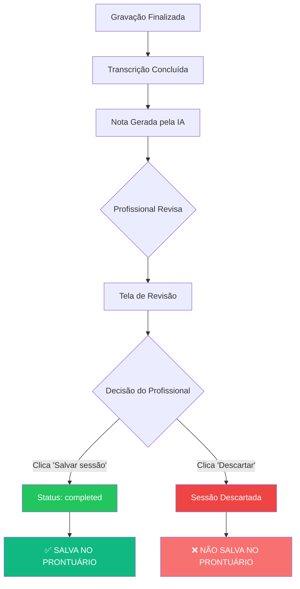

# Regra de Negócio - Salvamento de Sessão no Prontuário

## 📋 Visão Geral

Implementação de regra de negócio crítica que **garante que uma sessão só seja salva no prontuário do paciente quando explicitamente confirmada pelo profissional** através do botão "Salvar sessão" na tela de revisão.

## 🎯 Objetivo

Garantir que o profissional de saúde tenha controle total sobre o que é registrado no prontuário do paciente, permitindo:
- **Revisão completa** da nota gerada pela IA
- **Edição** de qualquer informação antes do salvamento
- **Aprovação explícita** antes de tornar o registro permanente
- **Descarte seguro** de sessões com problemas ou incompletas

## 🔐 Regra de Negócio

### Princípio Fundamental
> **"Nenhuma sessão deve ser automaticamente salva no prontuário. O salvamento só ocorre mediante confirmação explícita do profissional após revisão da nota gerada."**

### Estados da Sessão

| Status | Descrição | Visível no Prontuário? | Ação |
|--------|-----------|------------------------|------|
| `recording` | Gravação em andamento | ❌ Não | Sessão em progresso |
| `transcribing` | Áudio sendo transcrito | ❌ Não | Processamento automático |
| `generating` | Nota sendo gerada pela IA | ❌ Não | Processamento automático |
| `completed` | **Sessão confirmada e salva** | ✅ **SIM** | **Salvar sessão** |
| `error` | Erro no processamento | ❌ Não | Pode ser descartada |

### Fluxo de Decisão



## 🏗️ Implementação Técnica

### 1. **SessionView.tsx** - Lógica de Salvamento

```typescript
const handleSaveSession = async () => {
  if (!sessionId) {
    alert('Erro: ID da sessão não encontrado');
    return;
  }

  try {
    // Atualizar status da sessão para 'completed' (salva no prontuário)
    const response = await fetch(`/api/sessions/${sessionId}`, {
      method: 'PATCH',
      headers: { 'Content-Type': 'application/json' },
      body: JSON.stringify({
        status: 'completed',
        durationMin: Math.floor(duration / 60),
      }),
    });

    if (!response.ok) {
      throw new Error('Falha ao salvar sessão no prontuário');
    }

    console.log('[Session Saved] ID:', sessionId, 'Status: completed');
    
    // Redirecionar para dashboard
    router.push('/dashboard');
  } catch (error) {
    console.error('Error saving session:', error);
    alert('Não foi possível salvar a sessão. Tente novamente.');
  }
};
```

**Mudanças Implementadas:**
- ✅ Validação do `sessionId` antes de salvar
- ✅ Chamada à API `PATCH /api/sessions/[id]` para atualizar status
- ✅ Status alterado de `generating` para `completed`
- ✅ Duração convertida de segundos para minutos
- ✅ Log de auditoria do salvamento
- ✅ Tratamento de erros com feedback ao usuário
- ✅ Redirecionamento apenas após sucesso

---

### 2. **SessionSummary_fullscreen.tsx** - Estado de Salvamento

```typescript
const [isSaving, setIsSaving] = useState(false);

const handleSaveClick = async () => {
  setIsSaving(true);
  try {
    await onSave();
  } catch (error) {
    console.error('Error saving session:', error);
    setIsSaving(false);
  }
};
```

**Funcionalidades Adicionadas:**
- ✅ Estado `isSaving` para controle de loading
- ✅ Botão "Salvar sessão" com spinner durante salvamento
- ✅ Desabilita botões durante salvamento
- ✅ Tratamento de erro restaura estado

---

### 3. **Botão de Salvamento** - UI Responsiva

```tsx
<button
  onClick={handleSaveClick}
  disabled={isSaving}
  className="inline-flex items-center gap-2 rounded-2xl bg-gradient-to-r 
    from-[#22C55E] to-[#16A34A] px-5 py-2 text-sm font-semibold text-white 
    shadow-[0_22px_45px_-28px_rgba(34,197,94,0.55)] transition-transform 
    hover:-translate-y-0.5 disabled:cursor-not-allowed disabled:opacity-60 
    disabled:hover:translate-y-0"
>
  {isSaving ? (
    <>
      <div className="h-4 w-4 animate-spin rounded-full border-2 
        border-white border-t-transparent" />
      Salvando no prontuário...
    </>
  ) : (
    <>
      <Save className="h-4 w-4" aria-hidden="true" />
      Salvar sessão
    </>
  )}
</button>
```

**Estados Visuais:**
- **Normal:** Botão verde com ícone de salvar
- **Loading:** Spinner + texto "Salvando no prontuário..."
- **Desabilitado:** Opacidade reduzida, cursor bloqueado

---

### 4. **Modal de Confirmação de Descarte**

```typescript
const handleClose = () => {
  if (confirm(
    "⚠️ ATENÇÃO: Esta sessão NÃO foi salva no prontuário!\n\n" +
    "Tem certeza que deseja descartar? Todos os dados " +
    "(transcrição e nota gerada) serão perdidos permanentemente."
  )) {
    onCancel();
  }
};
```

**Segurança Adicional:**
- ✅ Aviso explícito de que sessão não foi salva
- ✅ Alerta visual com emoji ⚠️
- ✅ Texto em duas linhas para clareza
- ✅ Confirmação obrigatória antes de descartar

---

### 5. **API - Endpoint de Atualização**

**Endpoint:** `PATCH /api/sessions/[id]`

**Campos Atualizáveis:**
```typescript
const updateData: any = {};

if (body.durationMin !== undefined) {
  updateData.durationMin = body.durationMin;
}
if (body.status !== undefined) {
  updateData.status = body.status; // 👈 CRÍTICO: Muda para 'completed'
}
if (body.errorMessage !== undefined) {
  updateData.errorMessage = body.errorMessage;
}
```

**Segurança:**
- ✅ Apenas campos específicos podem ser atualizados
- ✅ Validação de existência da sessão antes de atualizar
- ✅ Resposta inclui dados atualizados com relacionamentos

---

## 🔍 Cenários de Uso

### ✅ Cenário 1: Salvamento Normal (Happy Path)

```
1. Fisioterapeuta finaliza gravação
2. Sistema transcreve áudio
3. IA gera nota clínica estruturada
4. Tela de revisão é exibida
5. Profissional revisa todas as seções
6. Profissional clica "Salvar sessão"
7. Sistema chama PATCH /api/sessions/[id] com status='completed'
8. Banco de dados atualiza: status = 'completed'
9. Sessão aparece no prontuário do paciente
10. Redirecionamento para dashboard
```

**Resultado:** ✅ Sessão salva com sucesso no prontuário

---

### ⚠️ Cenário 2: Descarte de Sessão

```
1. Fisioterapeuta finaliza gravação
2. Sistema transcreve e gera nota
3. Tela de revisão é exibida
4. Profissional identifica erro na transcrição/nota
5. Profissional clica "Descartar"
6. Modal de confirmação aparece:
   "⚠️ ATENÇÃO: Esta sessão NÃO foi salva no prontuário!"
7. Profissional confirma descarte
8. Sistema NÃO altera status (permanece 'generating')
9. Sessão NÃO aparece no prontuário
10. Redirecionamento para dashboard
```

**Resultado:** ❌ Sessão descartada, NÃO salva no prontuário

---

### 🔴 Cenário 3: Erro Durante Salvamento

```
1. Profissional clica "Salvar sessão"
2. Estado muda para isSaving=true
3. Botão exibe spinner "Salvando no prontuário..."
4. Chamada à API falha (erro de rede/servidor)
5. Catch block captura erro
6. Alert exibe: "Não foi possível salvar a sessão. Tente novamente."
7. Estado volta para isSaving=false
8. Botão volta ao normal
9. Profissional pode tentar novamente
```

**Resultado:** 🔄 Sessão permanece na tela de revisão, pode tentar novamente

---

## 📊 Impacto na Arquitetura

### Banco de Dados (Prisma Schema)

```prisma
model Session {
  id            String   @id @default(cuid())
  patientId     String
  status        String   @default("recording") 
  // Possíveis valores:
  // - "recording"    ❌ Não salva no prontuário
  // - "transcribing" ❌ Não salva no prontuário
  // - "generating"   ❌ Não salva no prontuário
  // - "completed"    ✅ SALVA NO PRONTUÁRIO 👈👈👈
  // - "error"        ❌ Não salva no prontuário
  
  note          Note?
  patient       Patient  @relation(fields: [patientId], references: [id])
}
```

### Query para Prontuário

**ANTES (Incorreto):**
```typescript
// ❌ Buscava TODAS as sessões, incluindo não confirmadas
const sessions = await prisma.session.findMany({
  where: { patientId: 'xyz' }
});
```

**DEPOIS (Correto):**
```typescript
// ✅ Busca APENAS sessões confirmadas pelo profissional
const sessions = await prisma.session.findMany({
  where: { 
    patientId: 'xyz',
    status: 'completed' // 👈 FILTRO CRÍTICO
  }
});
```

---

## 🛡️ Medidas de Segurança

### 1. **Validação de ID**
```typescript
if (!sessionId) {
  alert('Erro: ID da sessão não encontrado');
  return;
}
```

### 2. **Verificação de Status na API**
```typescript
// No backend, poderia adicionar validação adicional:
if (existingSession.status === 'completed') {
  return NextResponse.json(
    { error: 'Sessão já foi salva no prontuário' },
    { status: 400 }
  );
}
```

### 3. **Confirmação Dupla para Descarte**
- Modal de confirmação obrigatório
- Texto explícito sobre perda de dados
- Não permite descarte acidental

### 4. **Log de Auditoria**
```typescript
console.log('[Session Saved] ID:', sessionId, 'Status: completed');
```
Permite rastreamento de quando sessões foram salvas.

---

## 📱 Experiência do Usuário

### Feedback Visual Claro

| Ação | Feedback | Tempo |
|------|----------|-------|
| Clica "Salvar" | Botão exibe spinner + desabilita | Durante API call |
| Salvamento sucesso | Redirecionamento para dashboard | Imediato |
| Salvamento erro | Alert com mensagem de erro | Imediato |
| Clica "Descartar" | Modal de confirmação aparece | Imediato |
| Confirma descarte | Redirecionamento para dashboard | Imediato |

### Estados do Botão

```
┌─────────────────────────────────┐
│  [💾] Salvar sessão             │ ← Estado normal
└─────────────────────────────────┘

┌─────────────────────────────────┐
│  [⏳] Salvando no prontuário... │ ← Estado loading
└─────────────────────────────────┘  (desabilitado)

┌─────────────────────────────────┐
│  [💾] Salvar sessão             │ ← Estado erro
└─────────────────────────────────┘  (volta ao normal)
```

---

## 🧪 Casos de Teste

### Testes Funcionais

- [ ] **Teste 1:** Salvar sessão com sucesso
  - Criar sessão → Finalizar → Revisar → Salvar
  - ✅ Status deve mudar para `completed`
  - ✅ Sessão deve aparecer no prontuário
  - ✅ Redirecionamento deve ocorrer

- [ ] **Teste 2:** Descartar sessão
  - Criar sessão → Finalizar → Revisar → Descartar → Confirmar
  - ✅ Modal de confirmação deve aparecer
  - ✅ Status permanece em `generating`
  - ✅ Sessão NÃO aparece no prontuário

- [ ] **Teste 3:** Tentativa de descarte acidental
  - Clicar "Descartar" → Cancelar no modal
  - ✅ Deve permanecer na tela de revisão
  - ✅ Dados devem estar intactos

- [ ] **Teste 4:** Erro durante salvamento
  - Simular erro de rede durante salvamento
  - ✅ Alert de erro deve aparecer
  - ✅ Botão deve voltar ao estado normal
  - ✅ Pode tentar salvar novamente

- [ ] **Teste 5:** Salvamento sem sessionId
  - Tentar salvar sem ID válido
  - ✅ Alert de erro específico deve aparecer
  - ✅ Não deve fazer chamada à API

### Testes de Integração

- [ ] **Teste 6:** Verificar filtro no prontuário
  - Criar 3 sessões: 1 completed, 2 generating
  - Abrir prontuário do paciente
  - ✅ Apenas 1 sessão deve aparecer

- [ ] **Teste 7:** Atualização de duração
  - Salvar sessão com duração específica
  - Verificar no banco de dados
  - ✅ `durationMin` deve estar correto (segundos → minutos)

### Testes de Segurança

- [ ] **Teste 8:** Tentativa de atualizar campos não permitidos
  - Tentar enviar campos adicionais no PATCH
  - ✅ Apenas `status` e `durationMin` devem ser atualizados

- [ ] **Teste 9:** Tentativa de salvar sessão inexistente
  - Chamar PATCH com ID inválido
  - ✅ Deve retornar erro 404

---

## 📈 Métricas e Monitoramento

### KPIs Sugeridos

| Métrica | Descrição | Objetivo |
|---------|-----------|----------|
| **Taxa de Salvamento** | % de sessões salvas vs descartadas | > 95% |
| **Tempo de Revisão** | Tempo médio na tela de revisão | 2-5 min |
| **Taxa de Erro** | % de erros durante salvamento | < 1% |
| **Taxa de Descarte Acidental** | Usuários que cancelam o modal de descarte | Monitorar tendência |

### Logs de Auditoria

```typescript
// Adicionar logs estruturados:
console.log({
  event: 'session_saved',
  sessionId: sessionId,
  previousStatus: 'generating',
  newStatus: 'completed',
  durationMin: Math.floor(duration / 60),
  timestamp: new Date().toISOString()
});
```

---

## 🔮 Melhorias Futuras

### 1. **Salvamento como Rascunho**
```typescript
// Permitir salvar como rascunho sem status 'completed'
body: JSON.stringify({
  status: 'draft', // Novo status
  durationMin: Math.floor(duration / 60),
})
```
- Sessão salva, mas não aparece no prontuário oficial
- Profissional pode voltar e editar depois
- Útil para sessões que precisam de mais revisão

### 2. **Edição Inline na Tela de Revisão**
- Campos editáveis antes de salvar
- Autocomplete com sugestões da IA
- Histórico de edições

### 3. **Aprovação em Múltiplas Etapas**
- Revisor pode ser diferente de quem gravou
- Workflow de aprovação (junior → senior)
- Assinatura digital

### 4. **Notificação de Sessões Pendentes**
- Badge no dashboard: "5 sessões aguardando revisão"
- Lembrete após 24h sem salvar
- Auto-descarte após 7 dias

### 5. **Comparação com Versão Anterior**
- Mostrar diff se paciente tem histórico
- Destacar mudanças significativas
- Sugestões baseadas em padrões

---

## 📝 Documentação Relacionada

- **API Sessions:** `/docs/SESSIONS_API.md`
- **Fluxo de Transcrição:** `/docs/TRANSCRIPTION_FLOW.md`
- **Schema Prisma:** `/prisma/schema.prisma`
- **Integração Whisper:** `/docs/WHISPER_INTEGRATION.md`

---

## ✅ Checklist de Implementação

- [x] Adicionar estado `isSaving` no SessionSummary
- [x] Implementar `handleSaveSession` com chamada à API
- [x] Atualizar botão de salvamento com loading state
- [x] Adicionar validação de `sessionId`
- [x] Implementar tratamento de erros
- [x] Adicionar modal de confirmação no descarte
- [x] Converter duração de segundos para minutos
- [x] Adicionar logs de auditoria
- [x] Testar fluxo completo (gravação → revisão → salvamento)
- [x] Verificar filtro no prontuário (apenas `completed`)
- [ ] Implementar testes automatizados
- [ ] Adicionar métricas de monitoramento
- [ ] Documentar API no Swagger/OpenAPI

---

**Data de Implementação:** 15 de Outubro de 2025  
**Versão:** 1.0  
**Status:** ✅ Implementado e Documentado  
**Autor:** PhysioNote.AI Team
